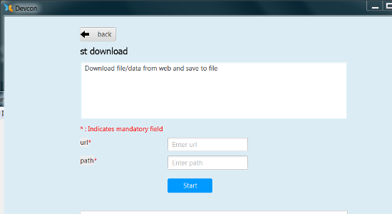

# we-dev-on Newsletter edition 10th of March 2017

## Introduction

@Thorsten: something like "...Welcome to the first edition of the iCSD News Letter 'we-dev-on'. This is a reader-supported publication dedicated to producing the best coverage of news, events, tips & tricks from within the devonfw & OASP communities all over Capgemini APPS2..."

## Webcasts "iCSD - Stuff That Matters"

This year we have started with a new webcast series for you, called "iCSD - Stuff That Matters" (thanks to Maurice Driessen for the great name). The idea is to organize webcasts dealing with topics which seem relevant for the community related with devonfw and OASP4j. Each session is planned for half an hour up to an hour with reserved time for Q&A. There, you will be able to ask anything related to the topic or iCSD in general.


We started with a highly attended first session the 27th of January 2017 by Angel Marin from Capgemini Spain (Valencia) about "Dealing with Complexity on the Front End". Angel took a look at one of our front-end options provided by devonfw: Devon4sencha. This framework is based on Sencha, a powerful Javascript framework for creating “very” rikh web applications. He showed how it makes it easy to deal with usually complex user interface patterns and during the session he explored some of the tools it provides. There was time for Q&A and we´re happy people did not hesitate to ask anything that came to their mind.

A second session was held the 24th of February by Jonas Molina Ramirez from Capgemini Germnay (Frankfurt) about "Testing with OASP4j". During his his talk Jonas investigated the testing facilities currently provided by OASP4J and he showed those features which aid you with

- Focus on test logic instead of infrastructure
- Manage your test data
- Configure your tests

The edited video of this talk has been uploaded to Teamforge and [can be found in the Server section](https://coconet.capgemini.com/sf/frs/do/viewRelease/projects.apps2_devon/frs.videos.devon_server?_message=1488358284665). It will be included soon in the devonfw Catalog in the 360 learning platform.

The third episode, planned for end of March / beginning of April, will deal with the ins and outs of Cobigen, the code generator in devonfw.
The Webcasts are definitely meant to be open. So, as always, you are very welcome to propose certain topics and / or present a topic yourself.

## Devcon command developers guide

The Devon Console, Devcon, is a cross-platform command line tool running on the JVM that provides many automated tasks around the full life-cycle of Devon applications, from installing the basic working environment and generating a new project, to running a test server and deploying an application to production. Devcon is the easiest way to use Devonfw. By accompanying on project automation, easy command execution and declarative configuration, it gets out of your way and let you focus on your code. 


In latest versions we´ve added the possiblity to create and integrate your own scripts very easily. In the current version we support JavasScript which is executed by Nashorn, the JavaScript interpreter included in Java 8 (so out of necesity we don´t support Java 7 for this feature). From within the script you can easily access the whole Java API, modules loaded in the CLASSPATH and even external JavaScript modules can be loaded. For example, to load the popular library LoDash you can include the following code fragment:

```javascript
load("https://raw.github.com/lodash/lodash/3.10.1/lodash.js")
_.map([1, 2, 3], function(n) { return n * 3; });
```

By using JavaScript your team will be able to easily integrate external tools and common utilities within an unified tool chain. For example the following example shows how it is possible to easily create a generic command to download a file using the native Java API. 

```javascript
function(url, path){
    var Files = Java.type("java.nio.file.Files")
    var URL = Java.type("java.net.URL")
    var Paths = Java.type("java.net.Paths")
    var website = new URL(url) // i.e. "http://devonfw.com"
    var _is = website.openStream()
    Files.copy(_is, Paths.get(path))  // i.e. "output.txt"
}
```

So when choosing the option in the menu, you can fill in the parameters in Devcon in the following manner:



Just press "start" and the web page or file is donwloaded and saved to the specified path.

All the details about how to incorporate your engagement specific and your own JavaScript functions within Devcon you can find in the Devcon Command Developers Guide (see down).

### Links

- [Oracle Nashorn: A Next-Generation JavaScript Engine for the JVM](http://www.oracle.com/technetwork/articles/java/jf14-nashorn-2126515.html)
- [devcon command developers guide](https://github.com/devonfw/devon-guide/wiki/devcon-command-developers-guide)


## devonfw-on-docker

@Christobal

## Spring Integration Devonfw Module

@PabloParra

## More Hip & interesting things

## Contributors

TODO only add real contributors to this issue

Many thanks to adrianbielewicz, aferre777, amarinso, arenstedt, azzigeorge, cbeldacap, cmammado, crisjdiaz, csiwiak, Dalgar, drhoet, Drophoff, dumbNickname, EastWindShak, fawinter, fbougeno, fkreis, GawandeKunal, henning-cg, hennk, hohwille, ivanderk, jarek-jpa, jart, jensbartelheimer, jhcore, jkokoszk, julianmetzler, kalmuczakm, kiran-vadla, kowalj, lgoerlach, ManjiriBirajdar, MarcoRose, maybeec, mmatczak, nelooo, oelsabba, pablo-parra, patrhel, pawelkorzeniowski, PriyankaBelorkar, RobertoGM, sekaiser, sesslinger, SimonHuber, sjimenez77, sobkowiak, sroeger, ssarmokadam, subashbasnet, szendo, tbialecki, thoptr, tsowada, znazir and anyone who we may have forgotten to add!
